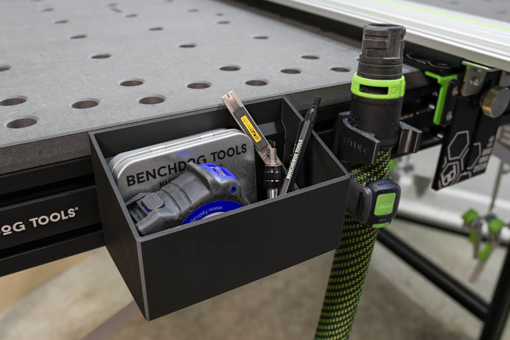
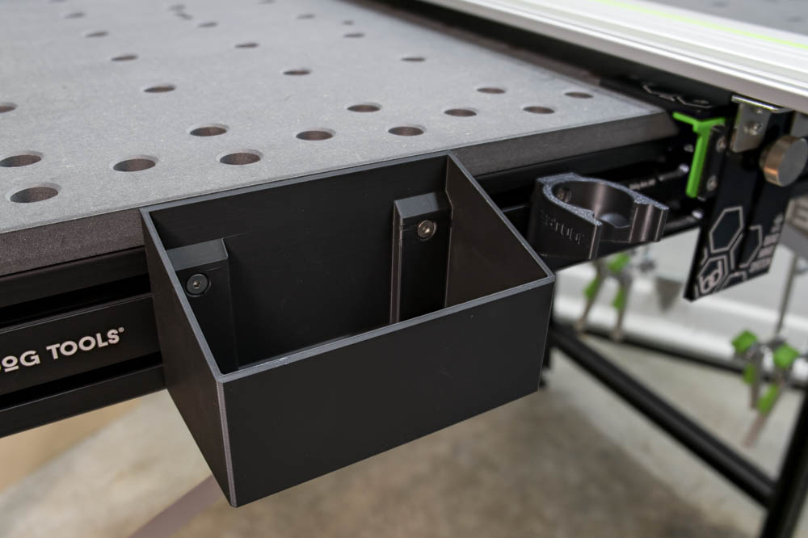

# Parametric T-Track Bin

Basic bin for use in T-tracks such as those in Benchdogs.co.uk Ultra MFT
Workstation or Festool MFT/3 table.

Any T-nut compatible with your T-track should work, however the bins were
designed for use with this [aligning T-nut](
https://github.com/nickewing/Benchdogs-Ultra-MFT-Workstation-T-Nuts).

For the Festool MFT/3, use the T-Nut from Festool's accessories such as their
[hose mount](
https://www.printables.com/model/806346-festool-d27-d36-suction-hose-holder).

Edit bin parameters in FreeCAD by changing values in the `Parameters`
spreadsheet.

NOTE: So far this has only been tested for use with the Benchdogs.co.uk
workstation.
